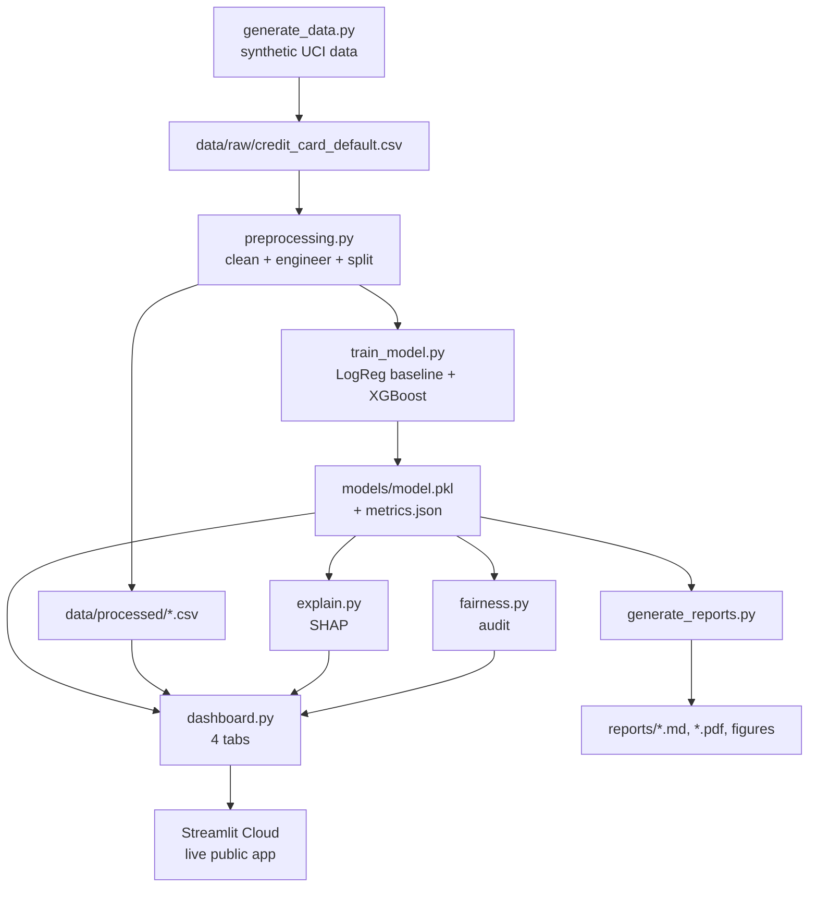

# 📘 PROJECT GUIDE — Credit Risk Scoring Simulator

**A complete, multi-level companion to the project.** It works as three things at once:

- 🎓 **Interview study guide** — understand *why* every part exists so you can explain it with confidence.
- 🛠️ **Technical reference** — know exactly what each file does and how the pieces connect.
- 📗 **Beginner tutorial** — learn the underlying concepts (numpy, pandas, ML, SHAP, fairness) from the ground up.

Each major concept is presented in three layers so you can read at your level:

> **① Basics** — plain-English, assumes little.
> **② In this project** — how it is actually applied here.
> **③ Quick reference** — the one-line version to memorise.

**Live app:** https://creditriskscoringsimulator-dzqtmjsoouv4ud4pk5siae.streamlit.app
**Repository:** https://github.com/phamhoangquynh21-spec/credit_risk_scoring_simulator

---

## Table of contents

1. [The big picture (what & why)](#1-the-big-picture-what--why)
2. [The data you must understand](#2-the-data-you-must-understand)
3. [The concepts you must understand](#3-the-concepts-you-must-understand)
4. [The analysis libraries (numpy, pandas, …)](#4-the-analysis-libraries-numpy-pandas-)
5. [External services & "connectors"](#5-external-services--connectors)
6. [File-by-file breakdown (with internals)](#6-file-by-file-breakdown-with-internals)
7. [How everything connects (data flow)](#7-how-everything-connects-data-flow)
8. [How to run it (command cheat-sheet)](#8-how-to-run-it-command-cheat-sheet)
9. [Skills demonstrated & interview talking points](#9-skills-demonstrated--interview-talking-points)
10. [Limitations & future work](#10-limitations--future-work)
11. [Appendix: glossary & key numbers](#11-appendix-glossary--key-numbers)

---

## 1. The big picture (what & why)

**① Basics.** A *lender* (bank, credit-card issuer, Buy-Now-Pay-Later company) gives customers credit and hopes they pay it back. Some customers **default** — they fail to pay. Predicting *who* is likely to default, *before* it happens, lets the lender make better decisions (approve, decline, adjust limits). This project builds a tool that predicts the probability a credit-card customer **defaults on their next monthly payment**, and — crucially — **explains why**.

**② In this project.** It simulates a fintech/BNPL risk-assessment workflow end-to-end: data → model → explanation → fairness check → interactive dashboard → business report. It is designed as a **portfolio piece** to demonstrate that you can do both the *Data Science* (build/evaluate a model) and the *Business Analyst* (frame the problem, communicate to non-technical stakeholders, consider ethics/regulation) sides.

**Two personas it serves:**

| Persona | Technical? | What they need | Which dashboard tab |
|---|---|---|---|
| **Risk Analyst** | Yes | A risk score for a customer; model performance metrics | *Single Customer Prediction*, *Model Performance* |
| **Risk Manager** | No | Plain-language reasons; segment comparisons; limitations | *Single Customer Prediction* (explanations), *Segment Analysis*, *Limitations* |

**③ Quick reference.** *Predict probability of next-month credit-card default (0–100 score + Low/Medium/High band), explain each score with SHAP, audit fairness, serve it in a Streamlit dashboard.*

**Why it matters for interviews:** credit scoring is a **regulated** domain. Being able to say "I didn't just maximise accuracy — I checked fairness across sex/age/education, made every prediction explainable, and documented the model's limits" signals maturity that fintech employers (Afterpay, Zip, the big-4 banks) look for.

---

## 2. The data you must understand

**① Basics.** The model learns from a table where **each row is one customer** and each **column is a fact about them** (credit limit, age, payment history…). One special column, the **target**, says whether that customer actually defaulted. The model finds patterns linking the facts to the target.

**② In this project.** The data is **synthetic** — generated by [`src/generate_data.py`](../src/generate_data.py) to *mirror the structure* of the real UCI *"Default of Credit Card Clients"* dataset (Taiwan, 2005). It is **not real customer data** (so there is no privacy/licensing issue), but the relationships are realistic: late payments and high credit utilisation genuinely drive default, so the model learns real signal. There are **30,000 customers**, a **~23.9% default rate** (an *imbalanced* dataset — more non-defaulters than defaulters).

### Data dictionary (raw columns)

| Column | Type | Meaning |
|---|---|---|
| `LIMIT_BAL` | number | Credit limit (NT dollars) |
| `SEX` | code | 1 = male, 2 = female |
| `EDUCATION` | code | 1 = grad school, 2 = university, 3 = high school, 4 = other (raw 0/5/6 also appear → cleaned to 4) |
| `MARRIAGE` | code | 1 = married, 2 = single, 3 = other (raw 0 → cleaned to 3) |
| `AGE` | number | Age in years |
| `PAY_0, PAY_2 … PAY_6` | code | Repayment status for the last 6 months (−1 = paid duly, 0 = revolving/minimum, 1–8 = months late). *Note: the UCI convention skips `PAY_1`.* |
| `BILL_AMT1 … BILL_AMT6` | number | Bill statement amount for each of the last 6 months |
| `PAY_AMT1 … PAY_AMT6` | number | Amount actually paid in each of the last 6 months |
| `default.payment.next.month` | 0/1 (**target**) | 1 = defaulted next month, 0 = did not |

### Engineered features (created in `engineer_features()`)

These are **new columns we compute** from the raw ones because they capture risk more directly:

| Feature | Formula | Why it helps |
|---|---|---|
| `avg_bill_amt` | mean of `bill_amt1…6` | Overall spending level |
| `avg_pay_amt` | mean of `pay_amt1…6` | Overall repayment level |
| `credit_utilization` | `avg_bill_amt / limit_bal` | How "maxed out" the card is — a strong risk signal |
| `months_delayed_count` | count of `pay_*` > 0 | How chronically late the customer is |
| `payment_trend` | `pay_amt1 − pay_amt6` | Whether payments are improving (+) or worsening (−) |

After engineering there are **28 feature columns** (23 raw predictors + 5 engineered) plus the target.

**③ Quick reference.** *30k customers, 23 raw + 5 engineered features, binary target, ~24% default (imbalanced), synthetic but UCI-structured.*

---

## 3. The concepts you must understand

### 3.1 Classification & probability

**① Basics.** *Classification* = predicting a category. Here it is **binary** (default: yes/no). The model outputs a **probability** between 0 and 1 (e.g. 0.82 = "82% likely to default"), which we multiply by 100 to get a **0–100 risk score**.

**② In this project.** The score maps to a **band** via [`config.risk_band()`](../src/config.py): Low (0–33), Medium (33–66), High (66–100).

### 3.2 Class imbalance

**① Basics.** When one class is much rarer than the other (24% default vs 76% not), a lazy model could "always predict no default" and be 76% accurate while catching **zero** defaulters. So **accuracy is misleading** here.

**② In this project.** We handle imbalance two ways: (1) tell the models to weight the rare class more (`class_weight='balanced'` for Logistic Regression, `scale_pos_weight` for XGBoost), and (2) judge the model with **AUC-ROC**, not accuracy.

### 3.3 Train/test split (and stratification)

**① Basics.** We train the model on one part of the data and test it on a *held-out* part it never saw, to check it generalises. **Stratified** splitting keeps the default rate the same in both parts.

**② In this project.** [`split_data()`](../src/preprocessing.py) does an 80/20 stratified split → **24,000 train / 6,000 test**, `random_state=42` for reproducibility.

### 3.4 The evaluation metrics (with this project's actual numbers)

The advanced model (XGBoost) on the 6,000-customer test set:

| Metric | Value | Plain meaning |
|---|---|---|
| **AUC-ROC** | **0.793** | Probability the model ranks a random defaulter as riskier than a random non-defaulter. 0.5 = coin flip, 1.0 = perfect. **Target ≥ 0.75 ✅** |
| **Recall** | 0.714 | Of all true defaulters, the share we caught (1021 of 1431). |
| **Precision** | 0.442 | Of everyone we flagged, the share who truly defaulted (1021 of 2310). |
| **F1** | 0.546 | Harmonic mean of precision & recall. |
| **Accuracy** | 0.717 | Share of all predictions correct — *shown but not trusted* due to imbalance. |

**Confusion matrix** (test set):

|  | Predicted: No default | Predicted: Default |
|---|---|---|
| **Actual: No default** | 3280 (TN) | 1289 (FP) |
| **Actual: Default** | 410 (**FN**) | 1021 (TP) |

**② The business insight (say this in interviews):** the costliest cell is **FN = 410** — defaulters we *missed* and approved. A missed defaulter loses real money; a false positive (1289) just annoys a good customer. So the 0.5 decision threshold should be **tuned to the business cost** of each error, not left at the default. High recall (0.71) is deliberately favoured over precision for this reason.

**③ Quick reference.** *AUC 0.79 (rank quality), recall 0.71 (defaulters caught), false negatives are the expensive error.*

### 3.5 Baseline vs advanced model

**① Basics.** Always build a **simple baseline** first, then see if a fancier model beats it. If the fancy model barely wins, the simple one may be better (easier to explain, faster).

**② In this project.** Baseline = **Logistic Regression** (AUC 0.791); advanced = **XGBoost** (AUC 0.793). They are nearly tied — an *honest* result worth discussing: on this signal, a linear model already captures most of it. XGBoost is kept as the production candidate but the small gap is disclosed.

### 3.6 Explainability (SHAP)

**① Basics.** A model can be a "black box". **SHAP** (SHapley Additive exPlanations) opens it: for any single prediction, it tells you how much *each feature pushed the risk up or down*. It comes from cooperative game theory — each feature is a "player" and SHAP fairly divides the "payout" (the prediction) among them.

**② In this project.** [`src/explain.py`](../src/explain.py) uses `shap.TreeExplainer` (fast & exact for tree models like XGBoost) to get the **top 5 factors** for a customer, then phrases them in plain English (e.g. *"Number of months with late payment (value: 4) increases the default risk"*) so a non-technical manager can read them (User Story US2).

### 3.7 Fairness / Responsible AI

**① Basics.** A credit model must not unfairly disadvantage groups (by sex, age, etc.) — it is often illegal to. A **fairness audit** measures whether the model treats groups differently.

**② In this project.** [`src/fairness.py`](../src/fairness.py) computes, per group: **selection rate** (how often the group is flagged high-risk), **recall**, and **precision**. It then reports **disparity ratios** (min/max across groups). A ratio below ~0.8 (the informal **"80% rule"**) flags a gap. Here the biggest gap is on **age group** — disclosed, not hidden. The philosophy is **detect-and-disclose**, not silently "fix" (mitigation is future work).

**③ Quick reference.** *Fairness = compare selection rate & recall across protected groups; disclose gaps; 80% rule as a rule-of-thumb.*

---

## 4. The analysis libraries (numpy, pandas, …)

**① Basics — what each one is:**

| Library | What it is (plain) |
|---|---|
| **numpy** | Fast arrays and math on numbers. The foundation everything else is built on. |
| **pandas** | Spreadsheet-like tables (`DataFrame`) in Python — load CSVs, filter, group, compute columns. |
| **scikit-learn** | The standard machine-learning toolkit: models, train/test split, metrics, pipelines, scaling. |
| **xgboost** | A high-performance "gradient boosting" model — often the best for tabular data. |
| **shap** | Explains individual model predictions (see §3.6). |
| **streamlit** | Turns a Python script into an interactive web app with almost no web code. |
| **plotly** | Interactive charts (hover, zoom) for the dashboard. |
| **matplotlib / seaborn** | Static charts, used for the report figures and notebooks. |
| **joblib** | Saves/loads the trained model to a `.pkl` file. |
| **pytest** | Runs the automated tests. |
| **reportlab** | Generates the PDF business report. |
| **openpyxl / tabulate** | Excel reading / markdown tables (support libraries). |

**② In this project — where each is used:**

| Library | Used in | For what |
|---|---|---|
| numpy | `generate_data.py`, `fairness.py`, `explain.py`, `train_model.py` | latent-variable math, sigmoid, array ops, confusion-matrix handling |
| pandas | every `src/*.py` | the `DataFrame` that flows through the whole pipeline |
| scikit-learn | `train_model.py`, `preprocessing.py` | `LogisticRegression`, `StandardScaler`, `Pipeline`, `GridSearchCV`, `train_test_split`, all metrics, `roc_curve` |
| xgboost | `train_model.py` | the advanced `XGBClassifier` |
| shap | `explain.py` | `TreeExplainer` → per-customer top factors |
| streamlit | `dashboard.py` | the 4-tab web app + caching |
| plotly | `dashboard.py` | gauge, ROC curve, confusion heatmap, box/bar charts |
| matplotlib | `generate_reports.py`, notebooks | PNG figures for the PDF/report |
| joblib | `train_model.py`, `dashboard.py`, `generate_reports.py` | save/load the model bundle |
| pytest | `tests/` | 13 automated tests |
| reportlab | `generate_reports.py` | `business_report.pdf` |

**③ Quick reference.** *numpy = math, pandas = tables, scikit-learn = ML + metrics, xgboost = the model, shap = explanations, streamlit + plotly = the dashboard, joblib = save model, pytest = tests, reportlab = PDF.*

The exact pinned versions are in [`requirements.txt`](../requirements.txt). This project was built and verified on **Python 3.14** with numpy 2.4, pandas 3.0, scikit-learn 1.9, xgboost 3.3, shap 0.52.

---

## 5. External services & "connectors"

You asked specifically about **external service connectors**. The most important, honest fact:

> ### ✅ The dashboard needs **NO external service connectors to run.**
> No database, no third-party API, no cloud data source, no authentication provider, no message queue. Everything it needs — the data and the model — is **generated locally inside the app itself**. This is *by design* and is why it deploys and "works perfectly" anywhere with zero configuration.

**Why:** on first launch the dashboard checks for `models/model.pkl`; if it is missing it **self-bootstraps** — it runs `generate_data` + training in-process (see the `main()` guard in [`src/dashboard.py`](../src/dashboard.py)). So a fresh deploy has no external dependency to connect to.

### The only external services involved (and they are about *hosting*, not *running*)

| Service | Role | Needed to *run* the app? |
|---|---|---|
| **GitHub** | Hosts the source code (the repository). | No — only to store/share code. |
| **Streamlit Community Cloud** | Hosts the *running* web app publicly and gives the live URL. | It *is* the host, but it needs no extra connector — it just points at `src/dashboard.py` and reads `requirements.txt`. |
| **Git Credential Manager** | A local tool that handles GitHub sign-in when you `git push`. | No — developer-side only. |

### What the data flow looks like (no external data source)

```
generate_data.py  →  data/raw/credit_card_default.csv  →  preprocessing  →
train_model.py  →  models/model.pkl + metrics.json  →  dashboard.py (reads local files)
```

### If you ever *productionised* this (future connectors)

To make it a real system you *would* add external connectors — worth naming in interviews:

- A **database** (PostgreSQL / BigQuery) instead of a local CSV, as the customer data source.
- A **credit-bureau API** for real-time external data.
- An **authentication provider** (OAuth/SSO) so only authorised analysts log in.
- A **model registry / feature store** (e.g. MLflow) for versioning.
- **Monitoring** (Datadog, etc.) for drift and uptime.

None of these exist in the current project — and that is the correct scope for a portfolio MVP.

**③ Quick reference.** *App = fully self-contained, zero external connectors to run. GitHub + Streamlit Cloud are hosting only. Real connectors (DB, bureau API, auth) are explicitly future work.*

---

## 6. File-by-file breakdown (with internals)

Every tracked file, its location, its job, and what is *inside* it.

### Configuration & metadata (root)

| File | What it is / what's inside |
|---|---|
| [`README.md`](../README.md) | Front page: highlights, data note, quickstart, structure, limitations, live link. |
| [`PRD.md`](../PRD.md) | Product Requirements Doc: vision, personas, 5 user stories + acceptance criteria, scope, risks, Definition of Done. |
| [`Technical_Spec.md`](../Technical_Spec.md) | Technical spec: tech stack, repo structure, data schema, **function-level signatures** for every module, testing & deployment plan. |
| [`DEPLOY.md`](../DEPLOY.md) | Step-by-step Streamlit Cloud deployment guide. |
| [`Credit_Risk_Scoring_Simulator_PreCoding_Plan.md`](../Credit_Risk_Scoring_Simulator_PreCoding_Plan.md) | The original (Vietnamese) 11-step planning document behind the whole project. |
| [`requirements.txt`](../requirements.txt) | Pinned Python dependencies. |
| [`pytest.ini`](../pytest.ini) | pytest config: `pythonpath=.`, `testpaths=tests`, verbose. |
| [`.gitignore`](../.gitignore) | Excludes `.venv/`, `models/*.pkl`, `data/processed/*.csv`, caches. |
| [`.streamlit/config.toml`](../.streamlit/config.toml) | Streamlit theme (primary colour) + headless server setting. |

### Source code — `src/`

Each module below matches a section of the Technical Spec.

**[`src/config.py`](../src/config.py)** — *the shared vocabulary.*
Central constants so every module agrees on names/paths. Inside: all filesystem **paths** (`RAW_CSV`, `PROCESSED_CSV`, `MODEL_PATH`, `METRICS_PATH`), **column groups** (`PAY_COLS`, `BILL_COLS`, `PAY_AMT_COLS`, `CATEGORICAL`, `ENGINEERED`, `TARGET`), human-readable **label maps** (`SEX_LABELS`, `EDUCATION_LABELS`, `MARRIAGE_LABELS`), the **risk-band** thresholds + `risk_band(score)` function, and `feature_columns(df)` (everything except target/id).

**[`src/generate_data.py`](../src/generate_data.py)** — *the synthetic data factory.*
`generate_raw(n=30000, seed=42)` builds a raw UCI-format DataFrame. **Internals:** draws a latent "financial distress" `r` per customer; repayment statuses (`_pay_status`), credit utilisation and bill/payment amounts all increase with `r`; the default label is drawn from `sigmoid(logit)` where the logit uses `r` + small demographic effects + noise. The noise is what caps AUC at a realistic ~0.79 (not a fake 0.99). `main()` writes the CSV and prints the default rate.

**[`src/preprocessing.py`](../src/preprocessing.py)** — *load → clean → engineer → split.*
- `load_data(path)` — read the raw CSV.
- `clean_data(df)` — lowercase/snake_case columns, rename the long target, fix invalid codes (EDUCATION 0/5/6→4, MARRIAGE 0→3), drop `id`.
- `engineer_features(df)` — add the 5 engineered columns; guards divide-by-zero in `credit_utilization`.
- `split_data(df)` — stratified 80/20 split.
- `build_processed_dataset()` — convenience: load→clean→engineer in one call.

**[`src/train_model.py`](../src/train_model.py)** — *train, evaluate, save.*
- `train_baseline()` — `Pipeline(StandardScaler → LogisticRegression(class_weight='balanced'))`.
- `train_advanced(model_type='xgboost')` — `GridSearchCV` (3-fold, scored on AUC) over a small grid; **falls back to RandomForest** if xgboost is unavailable; tags the fitted model with `model_type_`, `cv_best_auc_`.
- `evaluate_model()` — returns dict of auc/precision/recall/f1/accuracy/confusion_matrix.
- `save_model()` — `joblib.dump`.
- `run_training()` — the full pipeline: generate data if missing → build features → save processed CSV → split → train both models → save a **bundle** (`model`, `baseline`, `features`, `model_type`) to `model.pkl` and metrics to `metrics.json`.

**[`src/explain.py`](../src/explain.py)** — *SHAP + plain language.*
- `get_shap_values(model, X)` — `shap.TreeExplainer`.
- `_positive_class_values()` — extracts the default-class contributions (handles RF's 3-D vs XGBoost's 2-D output).
- `explain_single_customer()` — top-5 `(feature, contribution)` by absolute impact.
- `explain_in_plain_language()` — wraps each with a friendly name + a readable sentence (uses `FRIENDLY_NAMES`).
- `risk_score(model, X_row)` — probability × 100.

**[`src/fairness.py`](../src/fairness.py)** — *the audit.*
- `run_fairness_audit(model, X_test, y_test, protected_attrs)` — per-group table of n, actual default rate, selection rate, recall, precision. Buckets age via `_age_group` (`AGE_BINS`/`AGE_LABELS`) and maps codes to labels.
- `disparity_summary(audit)` — min/max ratios of selection rate & recall per attribute.

**[`src/dashboard.py`](../src/dashboard.py)** — *the Streamlit app (4 tabs).*
Cached loaders (`@st.cache_resource` for the model, `@st.cache_data` for metrics/data/test-split) to meet the <2s target. `build_customer_row()` turns form inputs into an engineered feature row. `main()` self-bootstraps if the model is missing, then renders:
1. `tab_prediction` — input form → risk score + gauge + SHAP bar + sentences (US1/US2).
2. `tab_performance` — AUC/precision/recall/F1, ROC curve, confusion heatmap, feature importance (US3).
3. `tab_segments` — risk distribution by sex/education/age (US4).
4. `tab_limitations` — disclaimers + live fairness table + disparity summary (US5).

**[`src/generate_reports.py`](../src/generate_reports.py)** — *deliverable generator.*
Loads the model+metrics, makes matplotlib figures (`class_balance`, `feature_importance`, `risk_by_age`), writes `fairness_audit_report.md` and `business_report.md`, and renders `business_report.pdf` via reportlab (table of headline metrics + embedded figures).

**[`src/__init__.py`](../src/__init__.py)** — marks `src` as a package; holds `__version__`.

### Tests — `tests/`

| File | Covers |
|---|---|
| [`tests/test_preprocessing.py`](../tests/test_preprocessing.py) | invalid-code fixing, snake_case, target rename, engineered columns exist & have no NaNs, zero-limit safety, stratified split. |
| [`tests/test_model_pipeline.py`](../tests/test_model_pipeline.py) | end-to-end train→predict gives valid probabilities, `evaluate_model` keys, advanced model beats chance, SHAP returns sorted top-5, risk score in 0–100. |

**13 tests total, all passing.** Run: `pytest`.

### Notebooks — `notebooks/`

| Notebook | Content |
|---|---|
| [`01_eda.ipynb`](../notebooks/01_eda.ipynb) | Exploratory analysis: distributions, target imbalance, default rate by `pay_0`, correlations with target. |
| [`02_modeling.ipynb`](../notebooks/02_modeling.ipynb) | Trains baseline + advanced, ROC comparison, feature importance. |
| [`03_fairness_audit.ipynb`](../notebooks/03_fairness_audit.ipynb) | Runs the fairness audit, disparity summary, per-group selection-rate charts. |

### Data, models, reports

| Path | What's there |
|---|---|
| `data/raw/credit_card_default.csv` | The generated raw dataset (committed, ~3 MB). |
| `data/processed/` | Cleaned+engineered CSV (gitignored — regenerated by training). |
| `models/metrics.json` | Committed metrics (AUC, precision/recall/F1, confusion matrix, feature list). |
| `models/model.pkl` | The trained bundle (gitignored — regenerated). |
| `reports/business_report.md` / `.pdf` | Non-technical summary. |
| `reports/fairness_audit_report.md` | Full fairness findings. |
| `reports/figures/*.png` | Figures embedded in the reports. |

---

## 7. How everything connects (data flow)



**Read it as:** data is generated → cleaned & split → two models trained → saved as a bundle → the dashboard loads that bundle and, together with SHAP and the fairness audit, serves the four tabs; the same bundle also feeds the report generator. The only "external" step is Streamlit Cloud hosting the finished app.

---

## 8. How to run it (command cheat-sheet)

```bash
# 0. From the project root, with the virtual environment active
python -m venv .venv
.venv\Scripts\activate               # Windows (PowerShell/cmd)
pip install -r requirements.txt

# 1. Generate data + train models  → models/model.pkl + metrics.json
python -m src.train_model

# 2. (optional) Generate reports    → reports/*.md, *.pdf, figures/
python -m src.generate_reports

# 3. Run the tests                  → 13 passing
pytest

# 4. Launch the dashboard           → http://localhost:8501
streamlit run src/dashboard.py

# 5. (only needed once) Generate just the data
python -m src.generate_data
```

> **Tip:** you can skip step 1 entirely — the dashboard **self-bootstraps** and trains on first launch if the model is missing.

---

## 9. Skills demonstrated & interview talking points

**Skills this project proves you have:**

- **Data Science:** feature engineering, handling class imbalance, baseline-vs-advanced modelling, cross-validated hyperparameter tuning, proper held-out evaluation, choosing AUC over accuracy.
- **ML Engineering:** clean modular `src/` package, a reusable pipeline, model serialisation, caching for performance, an automated test suite, reproducibility (`random_state=42`).
- **Explainable / Responsible AI:** SHAP explanations, a fairness audit with disparity ratios, honest limitation disclosure.
- **Business Analysis:** spec-first workflow (PRD + Technical Spec), user stories with acceptance criteria, a non-technical business report, cost-of-error reasoning.
- **Delivery:** Git, GitHub, public deployment, documentation.

**Talking points (rehearse these):**

1. *"Why XGBoost and not deep learning?"* — For tabular data, gradient boosting usually beats neural nets; using the right tool beats chasing trends.
2. *"Why is accuracy not your headline metric?"* — The data is imbalanced (24% default); a do-nothing model is 76% accurate but useless. AUC-ROC measures ranking ability instead.
3. *"Which error worries you most?"* — False negatives (missed defaulters, 410 of them) — they cost real money — so I favour recall and would tune the threshold to business cost.
4. *"How is this responsible?"* — Every score is explainable via SHAP, and I audited fairness across sex/age/education and disclosed the largest gap (age) rather than hiding it.
5. *"What are the limits?"* — Synthetic data mirroring UCI Taiwan 2005, not calibrated to Australia, no bureau/transaction data — I'd validate on real local data before any use.

---

## 10. Limitations & future work

**Limitations (state them proudly — it shows maturity):**
- Built on **synthetic data** mirroring UCI Taiwan (2005) — not real customers, not AU-calibrated.
- No transaction-level, credit-bureau, or macroeconomic signals.
- Fairness audit is **detect-only** (no automated mitigation).
- Decision threshold left at 0.5 (should follow real loss economics).

**Future work:** validate on real local data; add behavioural/bureau features; add fairness *mitigation*; cost-based threshold tuning; a parallel Power BI descriptive dashboard; the productionisation connectors listed in §5.

---

## 11. Appendix: glossary & key numbers

**Glossary**

| Term | One-line meaning |
|---|---|
| Default | Customer fails to make their required payment. |
| Target / label | The column the model predicts (`default_payment_next_month`). |
| Feature | An input column the model learns from. |
| Class imbalance | One outcome much rarer than the other. |
| AUC-ROC | Ranking quality: chance a defaulter is scored riskier than a non-defaulter. |
| Precision | Of those flagged, how many truly default. |
| Recall | Of true defaulters, how many were caught. |
| Confusion matrix | 2×2 table of TN/FP/FN/TP. |
| False negative (FN) | Predicted safe, actually defaulted — the costly error. |
| SHAP | Per-prediction feature-contribution explanation. |
| Selection rate | How often a group is flagged high-risk. |
| 80% rule | Rule-of-thumb: a group's selection rate < 80% of the top group's suggests a fairness gap. |
| Stratified split | Train/test split preserving the class ratio. |

**Key numbers (memorise for interviews)**

| Number | Value |
|---|---|
| Customers | 30,000 (24,000 train / 6,000 test) |
| Default rate | 23.9% |
| Features | 28 (23 raw + 5 engineered) |
| Baseline (LogReg) AUC | 0.791 |
| Advanced (XGBoost) AUC | **0.793** (target ≥ 0.75) |
| Recall / Precision / F1 | 0.714 / 0.442 / 0.546 |
| Confusion matrix | TN 3280 · FP 1289 · FN 410 · TP 1021 |
| Tests | 13, all passing |

---

*This guide is a companion to [`README.md`](../README.md), [`PRD.md`](../PRD.md), and [`Technical_Spec.md`](../Technical_Spec.md). Numbers reflect the model trained with `random_state=42`; retraining reproduces them.*
